# Lesson 1: Fields, Forms, and Entries

**Welcome to the first lesson of GravityView Academy!** In this first lesson, we’ll start with the basic building blocks of GravityView – _Forms, Fields, and Entries._

Let’s get started!

## Forms

Everything starts with the Form. Even if you’re a new Gravity Forms or GravityView user, you’re probably very familiar with forms. These days, most websites have forms, which they use for a variety of purposes, like contact forms, business directories, RSVP lists, and more.

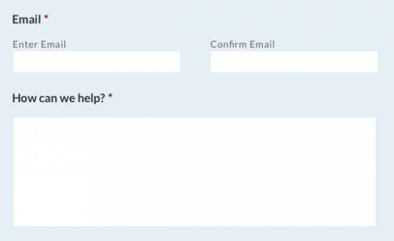

## The Structure of a Form

In order to grasp how Gravity Forms and GravityView work together, it helps to break down a form and understand its structure.

Put in the simplest terms possible, _a form allows users to submit information to the website._ A typical form has three basic components:

* **The place where users write their information.** These are called _Fields_ and include things like _Name,_ _Email_ or _Your Message._ Normally, Fields are text-boxes or other HTML elements, but they can also include a place to upload files, a date selector, or other specific things.
* **The submit button.** When the user clicks submit, the information is put into a single “package” and then sent somewhere \(usually to a database on the website\).
* **The submitted information,** which is viewable on the back end of the website. This “package” is called an _Entry._

**Make sense?** Let’s go through an example to be sure!

## Creating a Form in Gravity Forms

Let’s imagine that you’re throwing a potluck party at your apartment on the International Space Station. Since traveling into outer space isn’t cheap \(and the dining room is tiny!\) you want your guests to fill out a form beforehand. To do this, we want to create a form in Gravity Forms.

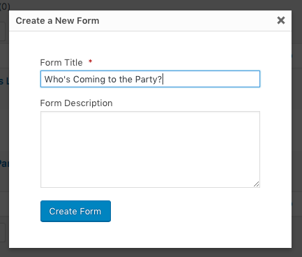

After you install the Gravity Forms plugin, navigate to the _New Form_ page on your WordPress sidebar. Then, we’ll need to give our form a name. Let’s call it _Who’s Coming to the Party?_ and click _Create Form_ to create the form.

Now we’re on the _Form Edit_ page. Here, we can customize our Form and pick which Fields we want to add. In Gravity Forms, there are a few different types of Fields.

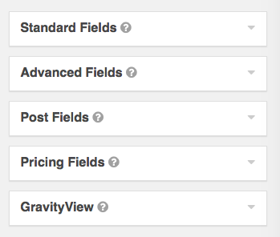

We won’t cover all of the differences in this lesson, but in brief:

* **Standard Fields** are for basic HTML elements, like text boxes, drop-down menus, and radio buttons.
* **Advanced Fields** are pre-optimized for specific purposes and include _Name, Date, Time, Email,_ and so on.
* **Post Fields** allow users to submit WordPress post drafts. They can submit the Post Title, Excerpt, Post Image, and related information.
* **Pricing Fields** enable you to sell products using your form. You can configure products and allow customers to purchase items using your form.
* **GravityView Fields** are for specific GravityView features, like Approving or Rejecting Entries or allowing users to opt-in to displaying their submission on the website.

## Creating Our Party Form

For our example, we want to gather four pieces of information from our party guests:

* Name
* Email
* The food they are bringing to the party
* A fun fact about themselves

### Drag-and-Drop

Now we simply need to drag a Field into the Form for each of the four items.

* We can use the _Name Field_ for names, which is on the _Advanced Fields_ tab.

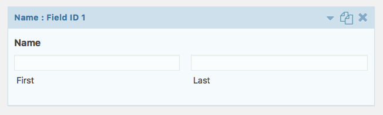

* For email, let's use the _Email Field_, which is also on the _Advanced Fields_ tab.

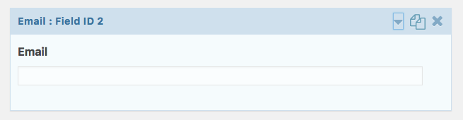

* For _What food or drinks are you bringing?_ we can use a _Paragraph Text Field,_ which is under _Standard Fields._

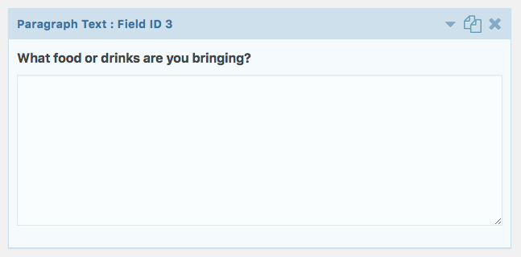

* Finally, for _What is a fun fact about yourself?_ we can use a _Single Line Text Field._

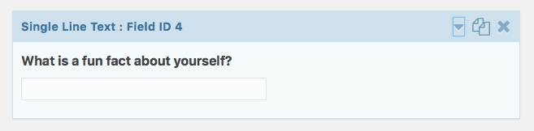

Double-check that everything looks right, then click _Update!_

### Putting the Form on a Page

Now that we’ve created our form, we need to put in on a page. To do this, simply create a new WordPress page. Then, on the Editor page, click _Add Form._

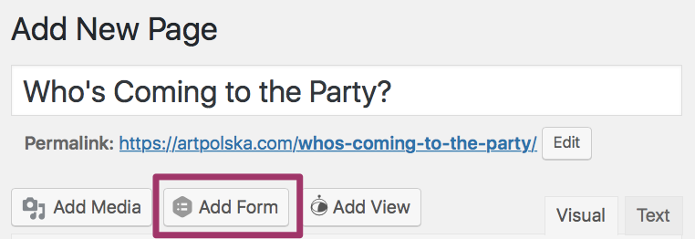

Select your form, customize the options, and click _Add Form._ You’ll then see a shortcode for your form. Finally, publish the page.

### Form Submission and Viewing Entries

Let’s see what the form looks like. If we navigate to the page, we’ll see our form. It looks good! Let’s fill out the fields and press submit.

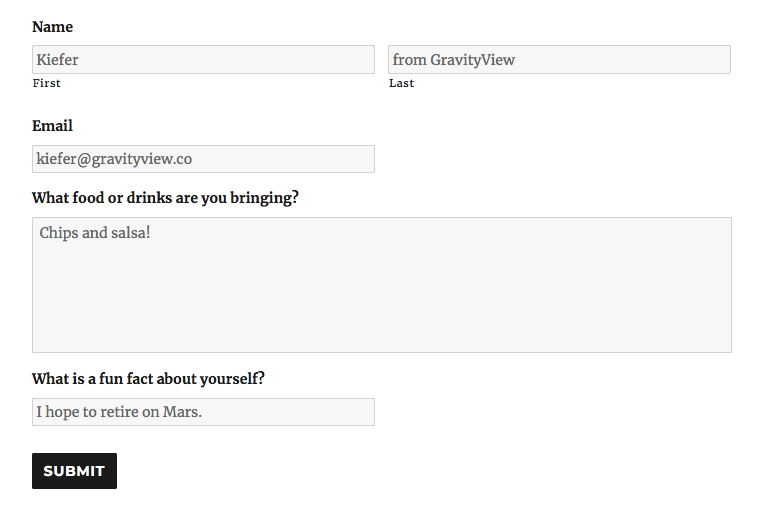

## What is an Entry?

Now, let's talk a little bit about Entries. As we mentioned before, an Entry is simply the data from one form submission, packaged together into one "unit". Entries are attached to a specific Form. It's important to understand the concept of an Entry, as they are fundamental to the way Gravity Forms and GravityView work.

To view your Entries, navigate to the _Forms &gt; Entries_ page and select your Form from the menu at the top of the page. You should see your submitted Entry listed.

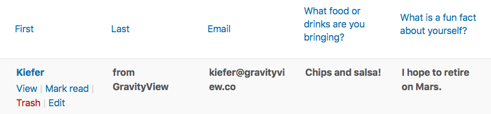

If you hover over the Entry itself and click _View,_ you can view the Entry details on a full page. This is useful if your Form has more than a few Fields \(or if each Field has a lot of information\).

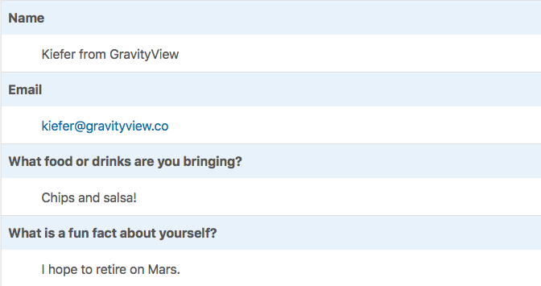

**And that’s it!** Hopefully you now understand how Forms, Fields and Entries work! In the next lesson, we’ll learn how these concepts connect to Views, which allow you to display your Entries on the front end of your website.

_Class dismissed!_

