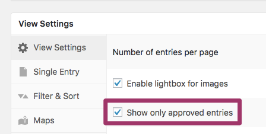
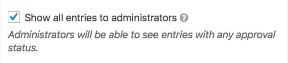
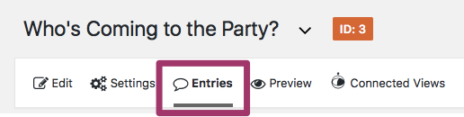
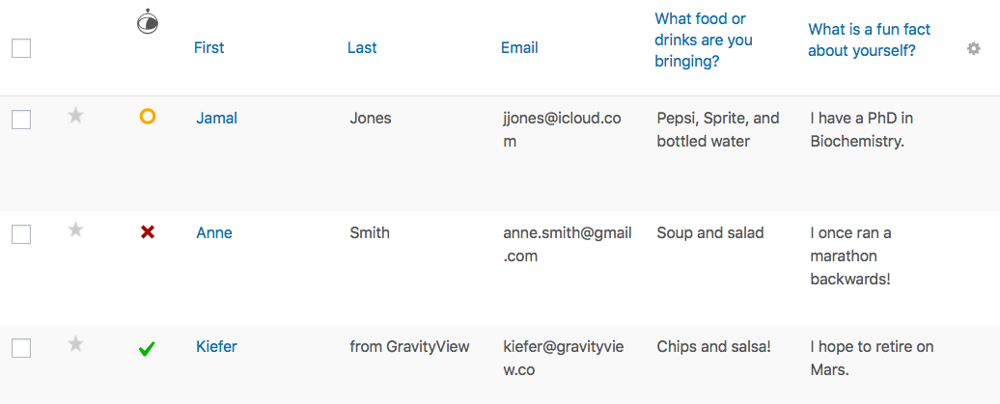
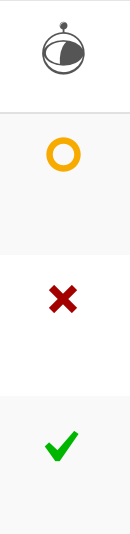
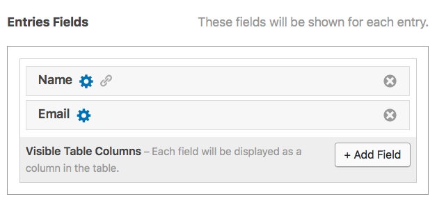
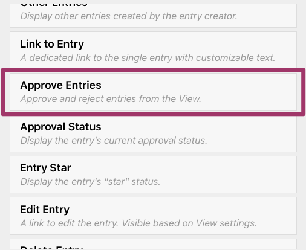
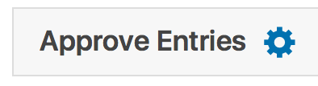
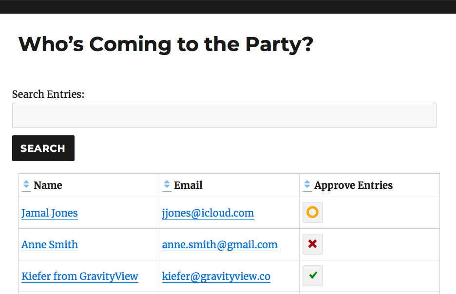
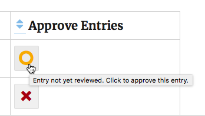

# Lesson 10: Approving and Rejecting Entries

In this lesson, we'll talk about one of the most-frequently-used features of GravityView - **Entry Approval and Rejection.**

Entry Approval is particularly useful for submission-style websites. **If you want to let users submit data *but* don't want it to automatically be added to the View, Entry Approval is for you.** In other words, you want to moderate submissions before displaying them in the View. As this is the most common use-case for this feature, we'll focus on it in this lesson.

### 1. Make sure *Show only approved entries* is enabled for your View.

Before you do anything else, make sure that you've enabled "Show only approved entries" for your View. This option is under the *View Settings > View Settings* tab on the View Configuration page.

### 2. Enable *Show all entries to administrators.*

After you enable the Show all entries option, a new option will appear below. When this is enabled, administrators will be able to see *all* Entries, not only the approved ones. This is particularly useful if you're using the Front End to approve and reject Entries.

### 3. Go to the Gravity Forms page for your desired Form.

Then, go to the *Gravity Forms > Entries* page for the form attached to your Entries. Click the *Entries* tab.

On the left-hand side, you'll see a column with a spaceman at the top. This is the *Approve/Reject* column.

**An Entry can have three possible statuses:**

- **Not Yet Reviewed,** which is represented by an orange circle
- **Rejected,** which is represented by a red X
- **Approved**, which is represented by a green checkmark

To change the status of an Entry, simply click on it. Once approved or rejected, an Entry cannot return to the "Not Yet Reviewed" status.

As we mentioned above, if you have enabled the "Show only approved entries" option, Entries will not be displayed in a View until they are manually given the *Approved* status by an administrator. That is to say - Entries with the *Not Yet Reviewed* or *Rejected* status will not be displayed. 

## Front End Entry Approval

Approving and Rejecting Entries in the back end WordPress dashboard is useful, no doubt. But what if you have a *ton* of Entries? Or what if you want [to give non-administrator users the ability to approve or reject Entries?](https://docs.gravityview.co/article/311-gravityview-capabilities)

In that case, you'll want to set up Entry Approval/Rejection on the front end, directly in the View itself. 

#### 1. First, go to the View Configuration page for your desired View.

Stay on the *Multiple Entries Context* tab and scroll down to the *Entries Fields* section. Click *Add Field.*

Then, scroll down in the modal window about halfway. We want the *Approve Entries* Field. Click it to add it to your View.

You can also edit the Field's settings by clicking on the blue gear icon.

#### 2. Then, update the View and preview it on your site.

The *Approve / Reject* column is now visible. 

To approve or reject an Entry, simply click on it:

And that's it! To read more about Front End Entry Approval, [check out this Knowledge Base article.](https://docs.gravityview.co/article/390-entry-approval)

## Other Tips and Tricks

#### The {approval_status} Merge Tag

The {approval_status} Merge Tag allows you display the approval status of Entries. [Check out this documentation for using it.](https://docs.gravityview.co/article/389-approvalstatus-merge-tag)

#### Modifying the CSS of Front-End Approval

Want to modify the CSS of the View you use for Front-End Approval? [Try this guide.](https://docs.gravityview.co/article/388-modifying-the-css-of-front-end-approval)

#### Hiding the Approve/Reject Column

Didn't find this lesson useful? Not a problem, you can also just [remove the Approve/Reject column entirely.](https://docs.gravityview.co/article/248-hiding-the-approvereject-entry-column)

