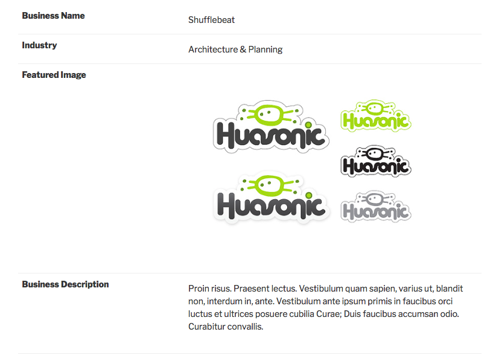
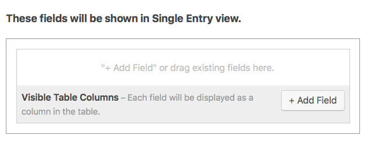
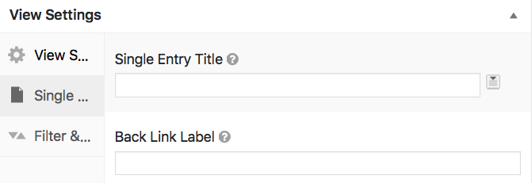

# Lesson 5: The Single Entry Context

You've made it to Lesson 5! Some congratulations is in order.🍾 At this point, you should be becoming a GravityView expert!

As we talked about the *Multiple Entries Context* in the last lesson. This lesson, we'll talk about the *Single Entry Context*.

Let's go!

## What is the Single Entry Context?

Put simply, the *Single Entry Context* is where you can put more details for each Entry. 

While the *Multiple Entries Context* is for displaying *a few details about many Entries* on an overview page, the *Single Entry Context* is for displaying *many details about a single Entry* on an individualized page.

**To summarize:**

- **Multiple Entries Context**
  - Many Entries, few Fields
- **Single Entry Context**
  - One Entry, many Fields

## Adding Fields to the Single Entry Page 

Now, let's add some Fields. To edit which Fields will display on the Single Entry Context, first go to the *Single Entry* tab.

Scroll down and you'll see a place for adding your Fields. To add a Field, simply click *Add Field.*

Just like the Multiple Entries Context, you can choose from all available Fields. Since we have much more room on this Single Entry page, we can add more Fields.

> **Pro-tip:** if you want to add the *Edit Entry Link* to your View, it's generally better to do so on the Single Entry Context and not the Multiple Entries Context. Why? More room.

It's really that simple! You can also fine-tune the settings by clicking on the gear icon next to each Field. If we preview our View, you'll see that we have much more room for displaying our Entry's Fields:

## View Settings

Way at the bottom of the *View Configuration* page, you can customize some settings for the *Single Entry Context*. 

**There are two options:**

- **Single Entry Title**
  - This lets you choose a different title for the Single Entry page. By default, the title will be the same as the one for the 
  - For example, you may want the *Multiple Entries Context* to be titled "List of All Businesses" while the *Single Entry Context* to be titled "Business Details".
- **Back Link Label**
  - This controls the text of the "return button." By default, it just says "Go back."

## Linking to the Single Entry Context

In the last lesson, we talked about linking to the Single Entry Context from the Multiple Entries Context. If you didn't get a chance to read that section, we'll cover it again here.

If you want to link an Entry on the Multiple Entries page to its Single Entry page. No problem? Simply click the gear icon next to the Field (make sure you're on the *Multiple Entries Context* tab first).

Then, click *Link to single Entry.* Once you enable this option, the Field will link to its Single Entry Context. 

When you enable the link option, the Field will have a small link icon displayed:

As an example: if your Field is *Business Name* and you enable *Link to Single Entry*, clicking on the *Business Name* Field will take to you that business's Single Entry page.

Although it is typically used on the *Name* field, you can also activate the *Link to Single Entry* option on any text Field.

---

**That about covers the Single Entry Context!** In the next lesson, we'll wrap up talking about View Contexts with the third and final one: the *Edit Entry Context.*

