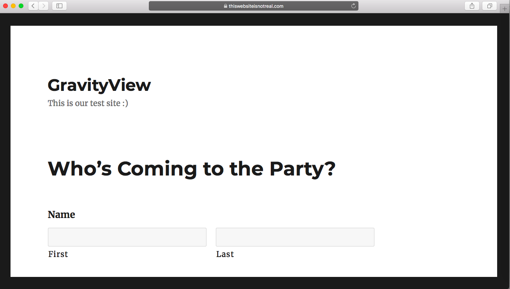
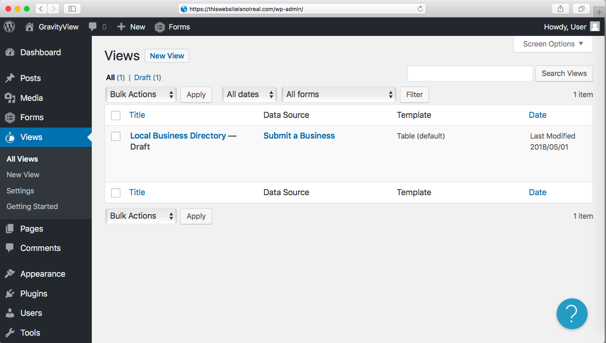
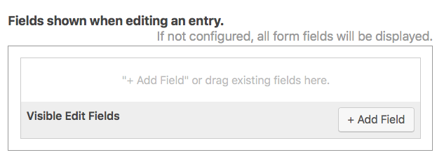
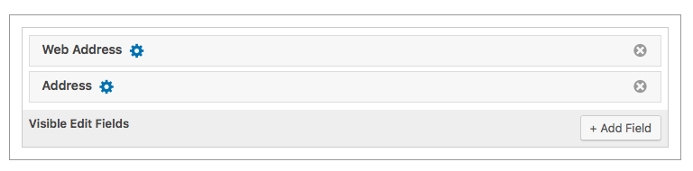
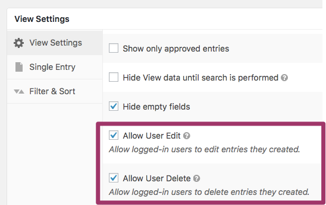
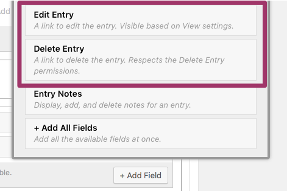
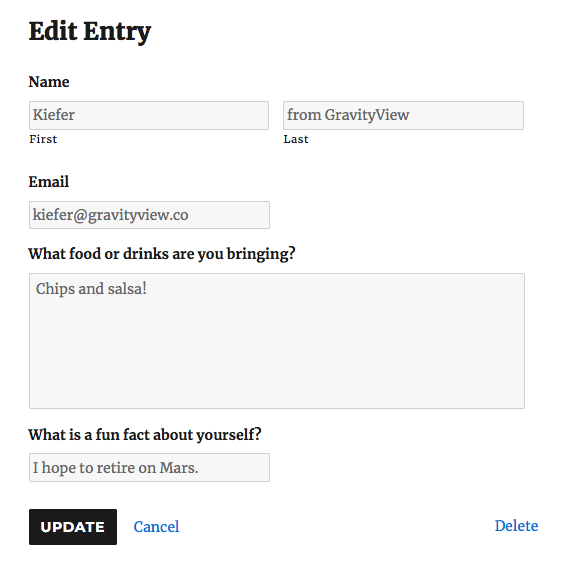
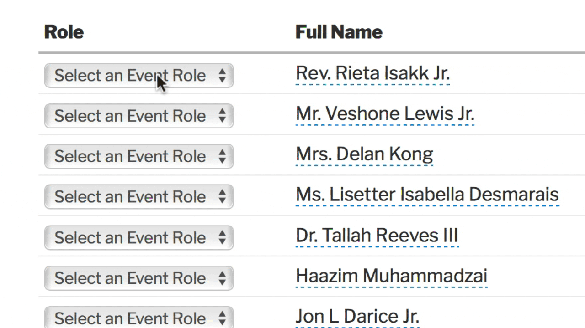

# Lesson 6: The Edit Entry Context

In Lesson 4, we talked about the *Multiple Entries Context.* In Lesson 5, we talked about the *Single Entry Context.* Now, in Lesson 6, we'll talk about the third and final context: *Edit Entry.*

The *Edit Entry Context* allows users (or administrators) to edit their Entries on the front end of the website, without having to manually log in to the back end.

Let's jump in!

## Refresher: Front End vs. Back End

We briefly talked about the concepts of *Front End* and *Back End* in Lesson 2, but let's refresh your memory:

- **The Front End is where users interact with your website.** On a WordPress website, the Front End is where Pages and Posts are displayed.

  

- **The Back End, alternatively, is where the website administrator(s) manages the site.** On a WordPress website, the Back End is also referred to as the "WordPress Admin page". By default, the URL for the Back End is *Example.com/wp-admin*.

  

Why is this important? Well, because the *Edit Entry* context is simply the part of the View that allows you to edit Entries ***on the Front End*.**

In Gravity Forms, the only way to edit the fields of an entry is on the Back End of the website. However, with GravityView's *Edit Entry* context, we can create a separate page that allows admins and/or users to edit entries.

## View Configuration

The View Configuration screen for the *Edit Entry* context is pretty straightforward.

To add a Field, simply click *Add Field.* There are no extra or special options; the only fields that you can add are the fields themselves. 

**Remember:** any fields that are added will be editable on the Edit Entry page. If for some reason you don't want a particular field to be editable, don't add it to the View. 

For example, you may want to let businesses change their Web Address or (physical) Address, but not their Business Name. In this instance, you'd simply add the *Web Address* and *Address* Fields and **not** add the Name Field. 

You can also drag-and-drop the Fields to be in the order you prefer.

**If you don't add *any* Fields, *all* form fields will be displayed and editable on the Edit Entry page.**

## Allowing Users to Edit Their Own Entries

By default, the Edit Entry page is only visible to administrators and users that have permission to edit entries in the WordPress back end.

But what if we want users to be able to edit and delete the fields in their entry? To do that, we'll need to enable some options in the *View Settings.*

> **Tip:** Want to let a particular user edit all entries, even if they didn't create them? [Check out this Knowledge Base article.](https://docs.gravityview.co/article/261-allowing-any-and-all-logged-in-user-to-edit-entries)

### *Allow User Edit* and *Allow User Delete*

Specifically, we want to enable two options:

- *Allow User Edit*
- *Allow User Delete*

When checked, logged-in users will be allowed to edit and delete Entries that they have created, respectively. They will *not* be able to edit or delete Entries created by other users.

To enable these options, simply scroll to the bottom of the View Configuration page. Under *View Settings*, check one (or both) options.

### Adding the Edit and Delete Fields

Now that we've allowed users to edit and delete their Entries, we need to add these fields to the View. If we don't manually add them to our View, users won't actually be able to access the Edit Entry page.

We can put these Fields on either the *Multiple Entries* page or the *Single Entry* page (or both). Traditionally-speaking, the *Single Entry* page is a better choice - it has more room for extra fields. But it's ultimately up to you!

To add the fields, simply click *Add Field* and scroll down to the bottom of the modal window. Then, click *Edit Entry* and/or *Delete Entry.*

These Fields will now be displayed on the Single Entry page. You can also customize the Fields by clicking the blue gear icon.

> **Tip:** We suggest changing the *Edit Entry* link text to something like, "Edit Your Information" or "Edit User Details." It's simply more user-friendly.

If we preview our View, you'll see that we now have two new links at the bottom:

Click on *Edit Entry* and to edit your Entries. Our party guests will no doubt find this useful!

Note that a *Delete Entry* link is also displayed below the Fields themselves, so including it directly on the Edit Entry page itself can be a little redundant:

It's also important to realize that these Fields will only be visible to Administrators *unless* you enable the *Allow User Edit* and *Allow User Delete* options that we mentioned in the last section. **Simply adding the fields is not sufficient; administrators will be able to see them, but logged-in users won't.**

### Some Additional Notes on *User Edit*

- When a user is logged-out, they will not see the Edit Entry links at all.
- When a user is logged-in, they'll only see links to edit the Entries that they have created.
- Administrators can edit all Entries. 
- Any WordPress User that has permission to edit Entries within Gravity Forms can also edit all Entries.
  - If you want to limit this capability, use the [Members plugin](http://wordpress.org/plugins/members/) to limit each user's "gravityforms_edit_entries" capability.

## A Final Note on the *Inline Edit* Plugin

**Normally, there are only two ways to edit Entries within Gravity Forms and GravityView:**

1. On the back end of the website on the *Forms > Entries > [Your Entry]* page for your particular Entry.
2. By adding the *Edit Entry* page to your View, as we detailed in this guide.

**However, with our *Inline Edit* plugin, you can add three more ways:** 

3. Directly on the Multiple Entries page.
4. Directly on Single Entry page.
5. Directly on the back end *Forms > Entries* page. 

This Premium plugin allows you to essentially bypass the Edit Entry page entirely. Rather than edit each Entry individually, one at a time, you can edit every Field with a single click. As you can imagine, this can save you a ton of time!

[Check out this page to learn more about the *Inline Edit* Premium plugin.](https://gravityview.co/extensions/gravityview-inline-edit/) We'll also be covering *Inline Edit* in a later lesson of GravityView Academy.

## Conclusion

That about covers the *Edit Entry Context!* In the next lesson, we'll talk about Searching for Entries and how to add a search function to your View.