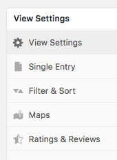
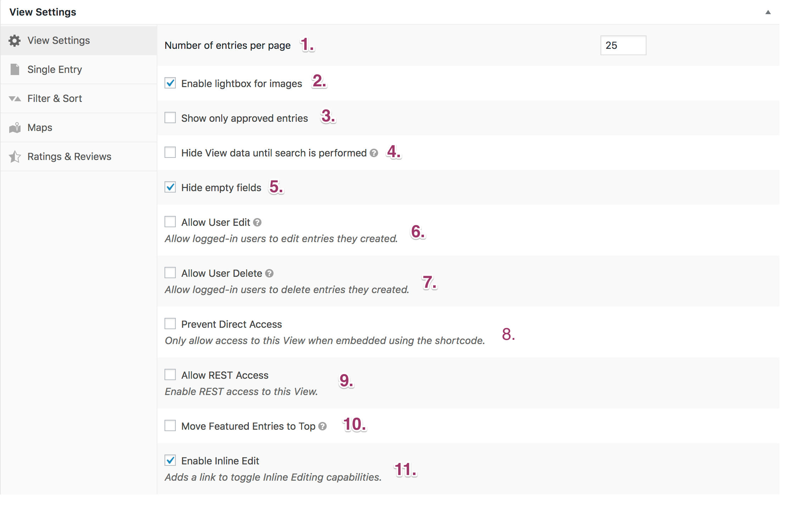
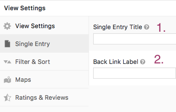
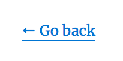
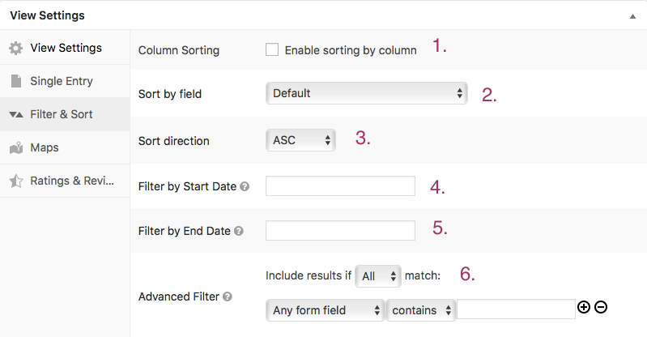
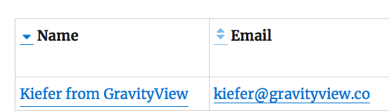

# Lesson 7: View Settings

Lucky number seven! At this point, you should have a pretty good idea of how the View Editor in GravityView works. In this lesson, we'll talk about the View Settings panel, which can be found at the bottom of the View Editor page:

Although we've covered mentioned many of these settings already, let's go through them one-by-one to refresh your memory. By default, the settings are grouped into three tabs:

- View Settings
- Single Entry
- Filter & Sort

**If you are using Premium plugins or extensions, you'll also see a tab for...**

* Maps
* Ratings and Reviews

## View Settings

The majority of the settings are grouped under the (aptly named) *View Settings* tab.

#### 1. Number of entries per page

This one is pretty straightforward - it lets you choose how many Entries to display per page. Want to display 1,000 Entries per page? No problem.

Keep in mind that you'll need to manually add Page Links widget to your View in order to navigate to other pages. If you don't add the widget, you won't see links to other pages. [See Lesson 4 for more information on how to do this.](lesson-04.md) 

#### 2. Enable lightbox for images

- If this is enabled, clicking on an image will open it in a lightbox on the same page.

- If it is not enabled, clicking on an image will open it in a separate browser tab.

#### 3. Show Only Approved Entries

- If this option is enabled, Entries will only be displayed after they have been approved by an administrator or other user with Gravity Forms access. This is useful for Forms which are open to the public and require moderation before publication.

- If this option is not enabled, Entries will be shown in the View immediatelly after they are submitted.

**To read more about Entry Approval, check out these Knowledge Base guides:**

- [Approving or Rejecting Entries](https://docs.gravityview.co/article/88-approving-or-rejecting-entries-in-gravityview)
- [Entry Approval](https://docs.gravityview.co/category/387-entry-approval)

#### 4. Hide View data until search is performed

- If enabled, your View will be blank upon loading, until a search is performed. This is useful if you have a large number of Entries and only want to display particular relevant ones - after a search, for example.
- If not enabled, your View will load with Entries visible.

#### 5. Hide Empty Fields

This option hides blank Fields on the Single Entry page. Unless you want to highlight an empty Field for a particular reason, it's generally best to keep it enabled.

#### 6. Allow User Edit

We talked about this option in the last lesson, *The Edit Entry Context.* If enabled, logged-in users will be able to edit the Fields of Entries they have created. If the user isn't logged-in, they won't see the *Edit Entry* links or be able to access the *Edit Entry* page. However, these links and pages will always be visible to administrators.

#### 7. Allow User Delete

We also talked about this option in the last lesson. If enabled, logged-in users will be able to delete the Entries that they have created. If the user isn't logged-in, they won't see the *Delete Entry* links or be able to access the *Edit Entry* page. As with the *Allow User Edit* option, these links and pages will always be visible to administrators.

#### 8. Prevent Direct Access

If enabled, the View will only be visible if it is embedded via a shortcode. The View will not be accessible directly. This is useful for design and branding purposes, as you can design a WordPress page to feature your Entries.

#### 9. Allow REST Access

// @zack: Not sure how exactly to communicate this

#### 10. Move Featured Entries to Top

**Note:** This setting requires the *Featured Entries* extension. [Purchase it here.](https://gravityview.co/extensions/featured-entries/)

- If enabled, Featured Entries will always be loaded at the top of search results.
- If not enabled, Featured Entries will be displayed in the default order, but will still be highlighted.

#### 11. Enable Inline Edit

**Note:** This setting requires the *Inline Edit* extension. Don't have it yet? [Read more about it here.](https://gravityview.co/extensions/gravityview-inline-edit/)

If enabled, users will be able to edit Entries directly in the View, from three locations:

1. Directly on the Multiple Entries page
2. Directly on Single Entry page
3. Directly on the back end *Forms > Entries* page

You can also control user access using filters.

##Single Entry 

This tab only has two options, both of which pertain to the *Single Entry Context.*

#### 1. Single Entry Title

This option allows you to customize the page title of the Single Entry page. For example, you may want to call the Multiple Entries page *Business Directory* and the Single Entry page *Business Details*.

If this option is left blank, the title will be the same as on the Multiple Entries page.

#### 2. Back Link Label

Here, you can customize the link that returns to the Multiple Entries page. By default, the link text is *Go back.*

## Filter & Sort

The third tab allows you to customize how your Entries are filtered and sorted.

#### 1. Column Sorting

If this option is enabled, users can click a small arrow to filter Entries by column:

#### 2. Sort by field

This option lets you choose which Field will be used to sort Entries on the Multiple Entries page. By default, Entries will be sorted by the first Field listed.

#### 3. Sort direction

Here, you can choose the order in which Entries will be displayed:

- **ASC** stands for *Ascending* and will list Entries from A to Z.
- **DESC** stands for *Descending* will will list Entries from Z to A.
- **Random** will list Entries in random order.

#### 4. Filter by Start Date

This option lets you only display Entries submitted ***after*** a certain date. It supports both specific dates and relative time periods, like "-1 week." It's useful if you want to display only the most recent submitted Entries.

#### 5. Filter by End Date

This option is the opposite of the above *Filter by Start Date*. It lets you display Entries submitted **before** a certain date. This is useful if you want to limit a View to a specific period of time, like "last month".

#### 6. Advanced Filter

These options allow you to filter what Entries are visible depending on certain parameters. For example, you can limit the displayed Entries to certain *Fields,* *Entry IDs,* *Payment Status*, or *Author (Created by).*

## *Maps* and *Ratings & Reviews*

We'll cover these other two tabs in separate individual lessons: X about the Maps plugin and Y about the Ratings and Reviews plugin.

---

That covers all of the *View Settings*! In the upcoming lessons, we'll learn how to do specific tasks, like search for Entries, embed Entries, and more.