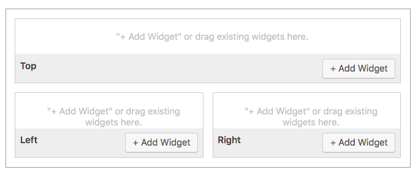
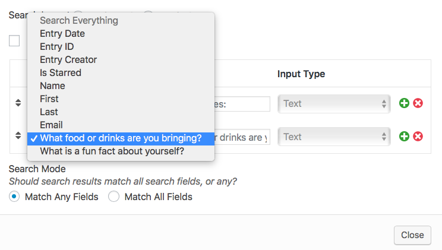
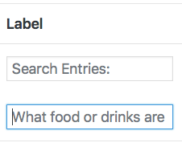
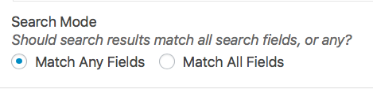
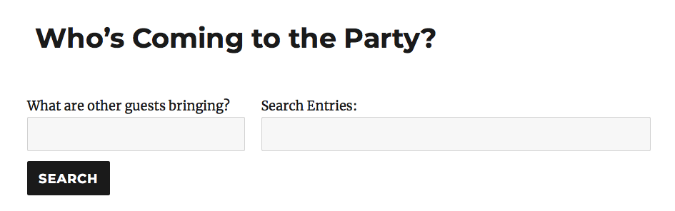
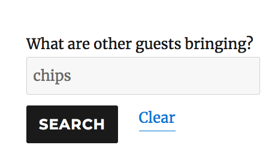
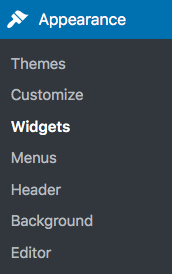
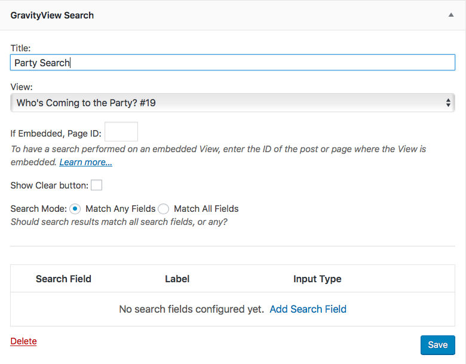

# Lesson 8: Searching for Entries

In this lesson, we'll talk about adding search functionality to your Views. GravityView's Search function is quite powerful and includes a variety of useful features.

Let's get searching!

## The Search Bar

Adding a search bar to your View is super easy. Simply go to the *View Configuration* page and click the *Multiple Entries* tab. 

If you remember from Lesson 4, the *Search Bar* is a GravityView widget. You can add Widgets to be above or below your Entries. Typically, the Search Bar is placed above Entries, but it's up to you!

To add a Widget, simply click *Add Widget*. 

 

Then, click *Search Bar* to add it to your View. To edit the settings, click the blue gear icon:

**You'll then see a number of options:**

- The Search Layout can be Horizontal or Vertical.
  - The Horizontal option will display Fields side-by-side
  - The Vertical option will display Fields stacked on top of each other
- If the *Show Clear button* option is enabled, a "Reset" button will be displayed *after* you start typing something into the Search Box. This button is not displayed on load. If you perform a search, the "Reset" button will be replaced by a "Clear" button.
- Finally, you can add and customize search fields. By default, it only includes one Search Field: "Search Everything".
  - To add a new Search Field, click the green "plus" button.
  - To remove a new Search Field, click the red "x" button.

**Let's add a new Search Field to see how it works.**

1. First, click the green "plus" button to add a new Search Field.
2. Then, click the drop-down box that just appeared under the Search Field heading.
   - Here, you can choose from a number of options. In addition to your Entry's Fields, you can also select *Entry Date*, *Entry ID*, *Entry Creator* and *Is Starred.* 
   - Let's select *What food or drinks are you bringing?* as we don't want our party guests to bring two of the same item. **This Search Field will only search for that Field within Entries.**

### Change the Label

Want to change the label? No problem. Simply type it in under "Label". By default, the label will be the same as the Field itself. Don't want to have a label at all? Just add one blank space (press your space bar one time).

Let's change our label to say *What are other guests bringing?* That way, guests can search for what items other people are bringing to the party and act accordingly.

### Different Fields, Different Input Types

Depending on the type of Field, you can choose different input types. For example, if you have a multiple-choice Field in your form, you can choose from...

- A drop-down box

- Select (multiple values)

- Radio buttons

- Checkboxes

- Links

  - The *Links* search type displays a list of links users can click to filter by a specific option:

  

  

### "Search Mode"

When you have multiple Search Fields displayed, a new option will appear below the Search Field box:

**You have two options:**

- *Match Any Fields*
  - If this option is selected, an Entry will be displayed in the search results if it matches at least *one* (but not all) of the Search Fields.
- *Match All Fields*
  - If this option is selected, an Entry will be displayed in the search results only if it matches all of the Search Fields.

Finally, you can re-arrange the Search Fields by dragging and clicking the arrows on the left side:

### It's Live!

Let's save and preview our View. We now have a nifty search bar at the Top above our Entries:

If we perform a search, our page will reload with all relevant results (if any exist). A "clear" button will also appear next to the search bar.

That about covers the search bar! Get searching!

## The WordPress Search Widget

**As a final note:** You can also add a View search box to any (WordPress) widget on your website. To do so, simply go to the *Appearance > Widgets* page on your WordPress sidebar.

Then, add the widget to a sidebar or footer. The configuration process is essentially the same as the one we covered above. The only new options have to do with the selection of your View. [Check out this Knowledge Base article for more details about the WordPress widget Search.](https://docs.gravityview.co/article/222-the-wordpress-search-widget)

