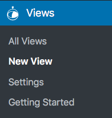
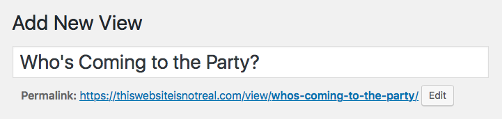
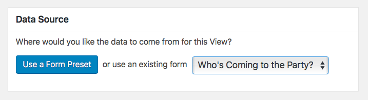
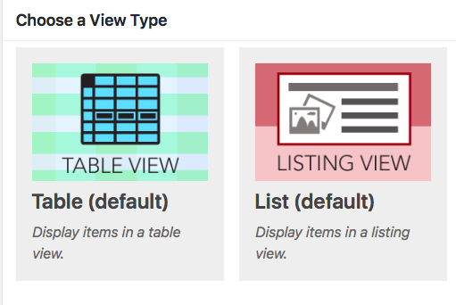
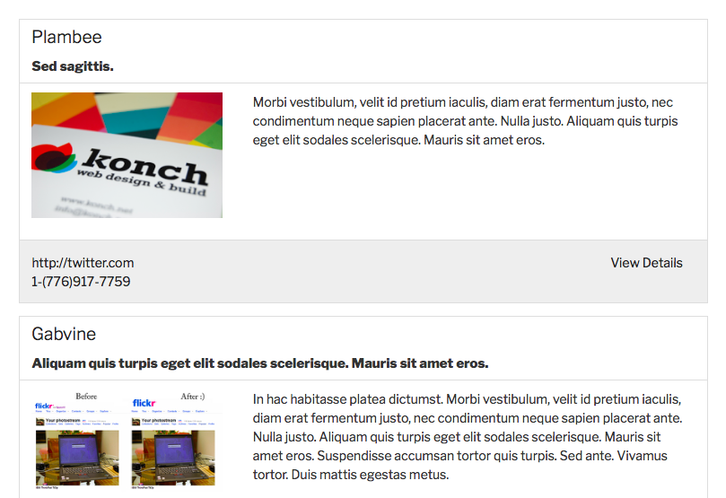
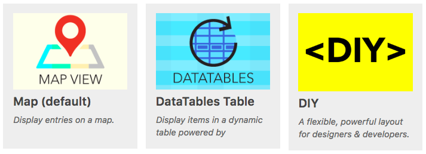
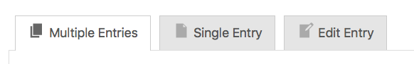

# Lesson 2: Views

**Welcome!** **For this lesson, you will need to have a Form created in order to complete this lesson.** If you don't have a Form configured, learn how to create a Form in [Lesson 1](lesson-1-fields-forms-and-entries/#forms).

In [Lesson 1](lesson-1-fields-forms-and-entries/), we talked about Forms, Fields, and Entries. In this lesson, we'll talk about setting up Views.

Let's get started!

## What is a View?

**A View is the display of Entries on the Front End of your website.** 

An Entry is simply the data from one form submission, packaged together into one "unit". Entries are attached to a specific Form and are created when a user submits the form.

In Gravity Forms, the only way to see these Entries is when you are signed into the WordPress administration area \(the "Admin" or "Dashboard"\). When you are logged-in to WordPress as an administrator, you can see entries by visitin the _Forms &gt; Entries_ page. There is no way to display or modify these Entries on the Front End on your website with Gravity Forms…and that's where GravityView comes in. 

GravityView allows you to create _Views_ - hence the company name 😁 **A View is the display of Entries on the user-facing part of your website.**

## Creating Your First View

To help you really understand this concept of a View, let's walk through creating our own. Let's continue our example from Lesson 1:

> Let’s imagine that you’re throwing a potluck party at your apartment on the International Space Station. Since traveling into outer space isn’t cheap \(and the dining room is tiny!\) you want your guests to fill out a form beforehand.

Now we want to go a step further and display these Form Entries on a page on the Front End of our site, so that everyone can see it. To do this, we need to create a View.

To create a View, go to the _View &gt; New View_ page on your WordPress sidebar.

We need to give our View a name. Let's call it _Who's Coming to the Party?_

### Connecting the View to a Form

Now we need to tell the View where the Entries will be coming from by connecting the View to a Form. Every View needs a Form, called the _Data Source._ We want to display the Entries created by the _Who's Coming to the Party?_ Form from [Lesson 1](lesson-1-fields-forms-and-entries/), so we choose that Form from the drop-down.

**Note:** We created this Form in Lesson 1. If you haven't yet completed Lesson 1, you'll need to go back and do it now.

### Choosing a Layout

After we choose a Data Source, we need to choose a Layout. A Layout is how our Entries will be displayed on the page. There are two default layouts in GravityView:

* Table Layout
* List Layout

Let's talk about each of them individually.

#### Table Layout

The Table Layout will display your Entries in a table. Entry information is displayed in columns and rows in a grid that looks like a spreadsheet or Excel document. Table layout allows for displaying lots of information in a small space.

#### List Layout

The List Layout will display your Entries in a more graphical layout that is . This is particularly useful for directories or listings.

#### Other Add-on Layouts

In addition to the Table Layout and Listing Layout, there are a few other Layouts available, such as [Maps](https://gravityview.co/extensions/maps/), [DataTables](https://gravityview.co/extensions/datatables/), and [DIY](https://gravityview.co/extensions/diy/). [They are included in a _Galactic License_.](https://gravityview.co/pricing/)

**Maps Layout**

Want to display your Entries on a Google Map? The Maps Layout has got you covered.

**DataTables Layout**

The DataTables Layout allows you to use [DataTables](https://datatables.net/), the best script for working for tabular data. Browse, filter, and sort entries with live updates.

**DIY Layout**

Are you a designer or developer? The DIY Layout lets you do-it-yourself.

## Configuring the View

For our example, let's just use the default Table Layout. Click the Table layout to select it.

After you choose the Layout, you'll be presented with a bunch of options - don't be intimidated! This is the View Configuration page. It's where all the action happens in GravityView.

This page is divided into three tabs:

* Multiple Entries
* Single Entry
* Edit Entry

We call these _Contexts_. You can think of them as different components, or sides, of a View. We'll cover each of them in more detail in future lessons.

In the next few lessons, we'll explore the _Multiple Entries,_ _Single Entry_ and _Edit Entry_ contexts in more detail.

