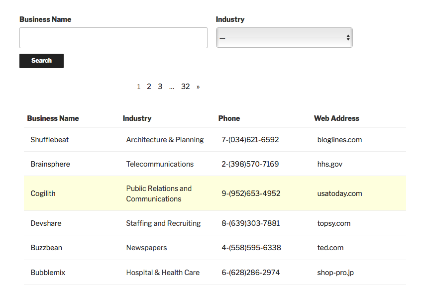
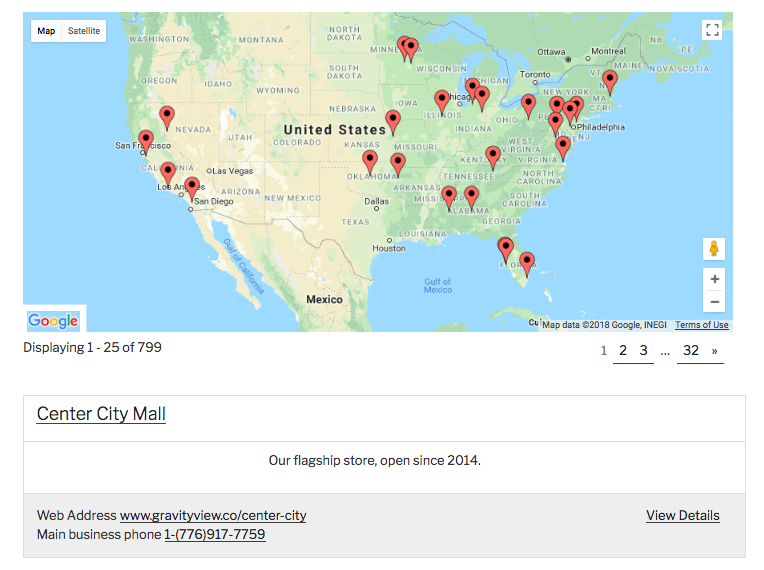
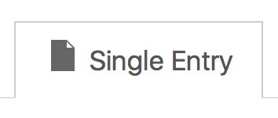
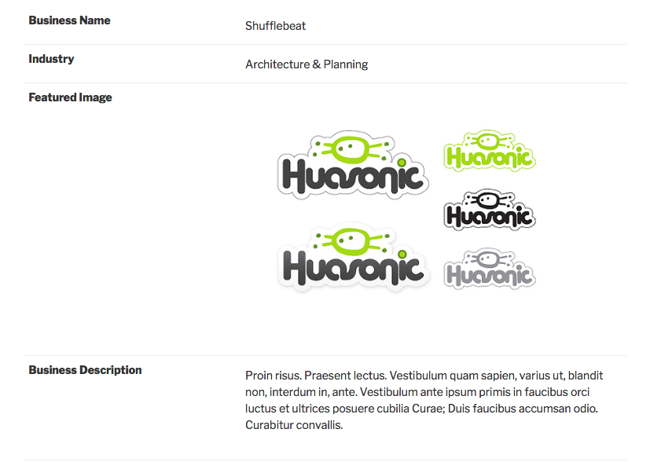
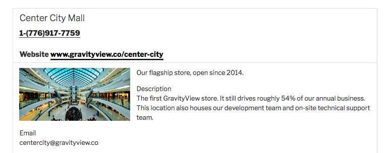
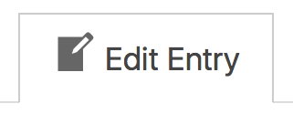
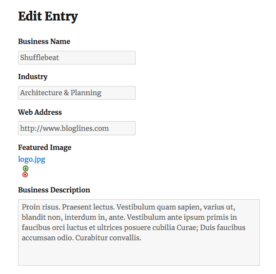
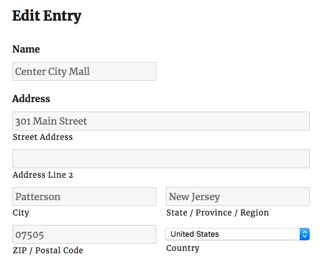

# Lesson 3: View Contexts

Welcome back to GravityView Academy! In the last lesson, we talked a bit about Views, Layouts, and connecting your View to a Form. We also started to create our first View.

In this lesson, we'll delve deeper into the View Configuration screen. Specifically, we'll talk about Contexts, which make up the View.

Let's get started!

## What is a Context?

The word _Context_ might seem a little abstract, but the concept is pretty simple. A Context is simply a part of the View. As we mentioned in the last lesson, a _View_ is the over-arching concept - when we use the word _View_, we are referring to the "whole package" of "viewing" Entries on the Front End of your site in a particular location.

**Every View is composed of three parts, which we call** _**Contexts**_**:**

* The Multiple Entries Context
* The Single Entry Context
* The Edit Entry Context

These three Contexts are simply different ways of looking at the Entries in your View. Let's talk about each of them individually!

## The Multiple Entries Context

The Multiple Entries Context is, in many ways, the "default" context. Put simply, the Multiple Entries Context displays multiple Entries on the page. Pretty easy, right?

You can choose the number of Entries displayed, how they are displayed, which Fields are displayed, and so on. We'll talk about fine-tuning the Multiple Entries Context in Lesson 4.

Another way of thinking about the Multiple Entries context is as the most "zoomed-out" portion of a View. It is an overview of all of the Entries in your View. For example:

**If your View is a directory of businesses, the Multiple Entries Context displays the basic details of all the businesses:**

**If your View is a map of retail stores, the Multiple Entries Context displays all of your stores on a map, along with their basic details:**

...and so on. The Multiple Entries is mostly intended to be a high-level overview of your content. Although you can choose to display as many Fields as you like, showing too many will result in a cluttered mess of a page.

So, if we want to display a large number of Fields for a specific Entry, we need to use a separate Context called _The Single Entry Context._

## The Single Entry Context

The Single Entry Context is a zoomed-in version of a particular Entry. This Context allows you to comfortably display as many Fields as you like on a single page. You can customize which Fields are visible, link an Entry's Single Entry Context to its Multiple Entries Context, and do other things.

We'll talk about fine-tuning the Single Entry Context in Lesson 5, but let's briefly talk about it now. To use our examples from the previous section:

**If your View is a directory of businesses, the Single Entry Context of a particular Entry displays more information about the business**:

**If your View is a map of retail stores, the Single Entry Context of a particular Entry displays more details about that store:**

Put simply, the Single Entry displays the Fields of a Single Entry. But what if you want to edit these Entries directly on the Front End, without having to log in to the Back End of your website? To do that, we need the _Edit Entry Context._

## The Edit Entry Context

The third and final View Context is perhaps the most straightforward one. The Edit Entry Context allows users \(or administrators\) to edit the Fields of an Entry directly from the View itself. That is, without having to log in to your WordPress website's Back End.

As you can imagine, this is extremely useful! Naturally, you can limit the ability to edit Entries only the the user who created the Entry. We'll talk about customizing the Edit Entry Context in Lesson 6.

Continuing with our examples:

**If your View is a directory of businesses, the Edit Entry Context of a particular Entry will let you edit the information \(Fields\) of that business \(Entry\):**

**If your View is a map of retail stores, the Edit Entry Context of a particular Entry will let you edit the details \(Fields\) of that store \(Entry\):**

## Conclusion

And that covers all three View Contexts! In the next lesson, we'll delve into the Multiple Entries Context.

_Class dismissed!_

