# Lesson 4: The Multiple Entries Context

Welcome to Lesson 4 of GravityView Academy! In the previous lesson, we discussed _View Contexts_ in general. In this lesson, we'll delve into the first View Context, which is called the _Multiple Entries Context_.

Grab your notebook and let's get started!

## Refresher: _What is a Context?_

Forget what a context is? Not to worry! A _Context_ is simply a part of the View. There are three parts, or Contexts, to every View:

* Multiple Entries
* Single Entry
* Edit Entry

If you're still confused about Contexts, you should go back and review Lesson 3. Don't feel bad about it - the concept of a View and its Context can be tough to grasp.

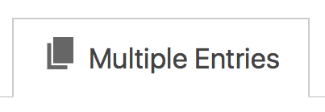

## The "Default" Context

The Multiple Entries Context can be considered the "default" context. That is, it's the "starting point" of the View. For most GravityView users, the Multiple Entries Context will be the most important part of the View.

## Multiple Entries at One Time

Put simply, the Multiple Entries Context displays many of your Entries at one time - hence the name. Generally speaking, this is intended to be a high-level overview of your content. You can think of it as the most "zoomed-out" way to look at a View.

While you can display as many Fields as you like, any more than a handful will result in a cramped view - pun intended. Instead, you should put those additional Fields in the Single Entry View \(which we'll talk about in the next lesson.\)

## View Layouts

If you recall, we talked about View Layouts in Lesson 2. By default, there are two standard layouts:

* Table Layout
* Listing Layout

There are also other Premium Layouts, including _Maps, DataTables,_ and _DIY Layout._ We'll cover each of them in a separate lesson.

The layout you choose is especially relevant when it comes to the Multiple Entries Context, as it is the primary way you \(or your users\) will probably interact with the View. The name of the Layout essentially describes how the View's Multiple Entries Context will look.

For example, the _Table Layout_ displays your Entries _in a table._ To put this in other words: **your Entries will be displayed in a table in the Multiple Entries Context.** Most of the "table-ness" of the Table Layout is in the Multiple Entries Context.

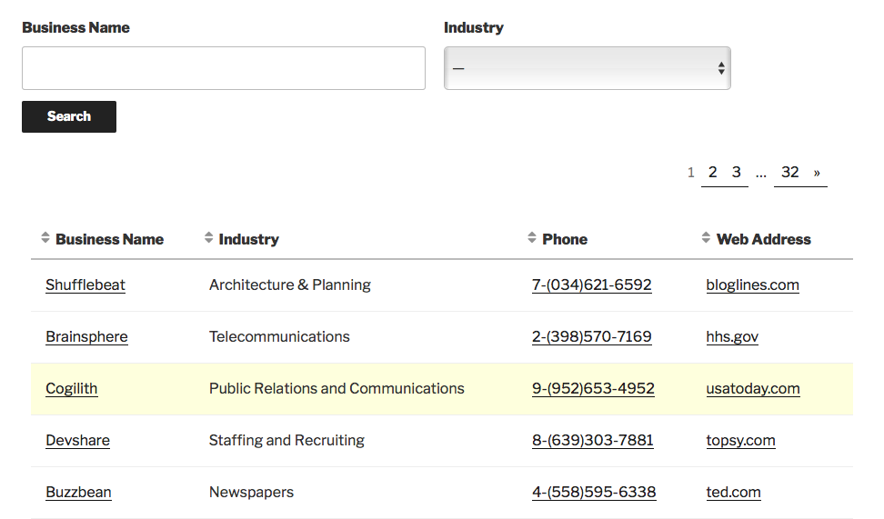

Likewise, the _Listings Layout_ will display your Entries in a listing. **That is, the Multiple Entries context of your View will be displayed as a listing.**

## Widgets

At the top and at the bottom of the Multiple Entries settings, you can add widgets. These widgets will be shown above your Entries and below your Entries, respectively.

> **Note:** These widgets are not the same thing as regular WordPress widgets!

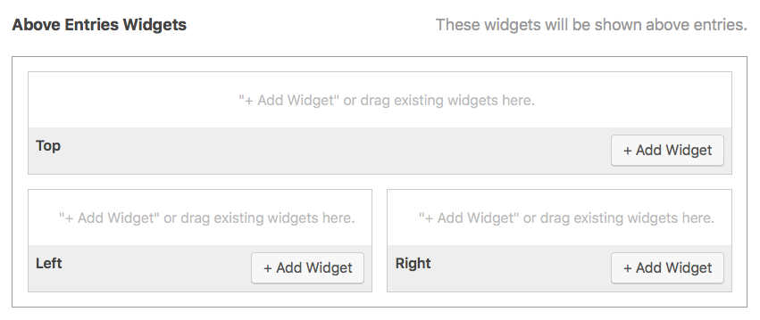

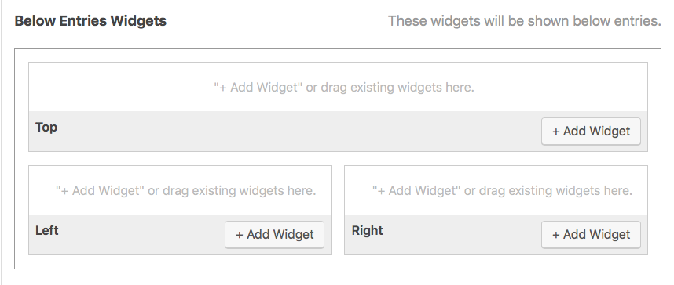

To add a widget, simply click _Add Widget_. Pretty easy! In the standard version of GravityView \(without extra add-on View Layouts\), there are four types of widgets you can add:

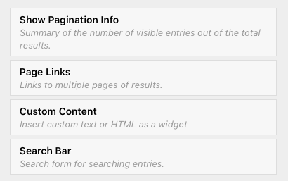

Let's briefly talk about each option!

#### Show Pagination Info

This allows you to display the number of Entries _displayed_ as compared to the _total_ number of Entries. This is useful if you have a large number of Entries spread across multiple pages.

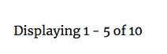

#### Page Links

This widget is pretty straightforward - it lets you display the page numbers. Note that if there are a large number of pages, not _all_ of the page numbers will be displayed automatically; instead, they will be summarized. For example:

If you want to display each and every page number, you'll need to click the little gear icon next to the _Page Links_ item.

Then, check the box next to _Show each page number_:

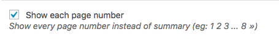

Now, every single page number will be displayed \(even if you have thousands of them!\)

#### Custom Content

The Custom Content is just a place to put your own text, HTML code, or WordPress shortcodes. To edit the content, click the little gear icon next to the _Custom Content_ item.

Then, type in your text, HTML, or shortcode. You can choose to automatically add paragraph tags, too.

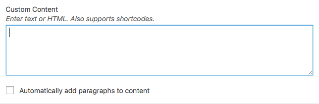

#### Search Bar

Finally, the last widget is the _Search Bar._ This widget allows you to add a search bar to your Multiple Entries Context. You can customize the Search Bar widget in a number of ways.

To do that, first click on the gear icon next to the Search Bar item.

You'll then be presented with quite a few options. You can choose the layout, whether to display a "clear" button, and filter the search results to only include specific Fields.

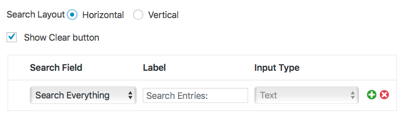

Remember that you can add these widgets to be above or below your Entries \(or even both!\)

## Adding Entries

Now, let's talk about the main part of the Multiple Entries Context - adding the Entry Fields themselves! You can add Fields on the middle of the page. Every Field you add to this section will be displayed for each Entry on your View.

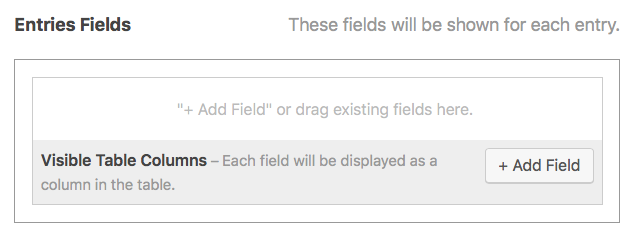

For example, if you add the "Business Name" Field here, it will be displayed for each Entry. **If you don't add a Field, it won't be displayed in your View.** This is important to understand! You need to manually add every Field that you want to display.

### Adding a Field

To add a Field, simply click _Add Field_. You'll then be presented with a modal of your Fields:

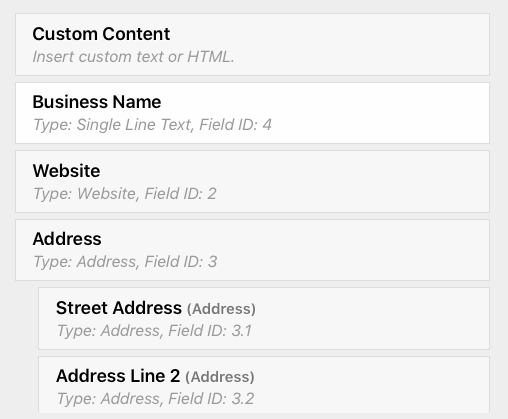

Scroll down to see all of the available Field options. All the way at the bottom, you'll see some other options, including _Edit Entry and_ _Delete Entry._ We'll talk about these in a separate lesson, but in short, these Field options allow you \(or your users\) to edit and delete Entries directly from the View \(on the front end\) without logging into the back end of the website.

### Options for Each Field

You can customize each Field by clicking the blue gear icon next to it. Each type of Field has different options - for example, the Website Field has settings that pertain specifically to displaying a URL.

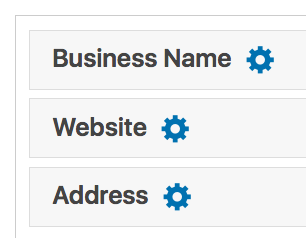

### Linking to the Single Entry Context

Perhaps the single most-used Field option is the _Link to Single Entry_ option. When you enable this option, the Field will link to its Single Entry Context.

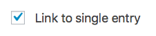

When you enable this option, the Field will have a small link icon displayed:

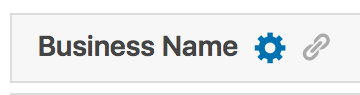

As an example: if your Field is _Business Name_ and you enable _Link to Single Entry_, clicking on the _Business Name_ Field will take to you that business's Single Entry page:

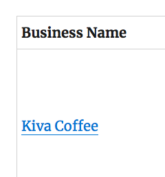

Although it is typically used on the _Name_ field, you can also activate the _Link to Single Entry_ option on a variety of Fields.

## View Settings

Finally, let's talk briefly about configuring the View Settings. While some of these are for other View Contexts, most of them pertain to the Multiple Entries Context.

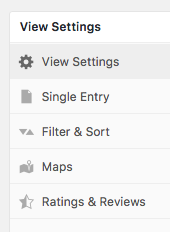

### View Settings

* **Number of Entries per page**
  * Here, you can choose how many Entries will be displayed per page.
* **Enable Lightbox for images**
  * If this enabled, images will display in a Lightbox \(a pop-up modal\).
* **Hide View data until search is performed** 
  * If this is enabled, your View will display zero Entries until a search is performed. This is particularly useful if you have a very large number of Entries and only want to display ones relevant to your particular user.
* **Hide empty Fields**
  * Enabled by default, this will hide any Fields that have no data.
* **Allow User Edit**
  * This allows logged-in users to edit their own Entries. They _won't_ be able to edit other's Entries.
* **Allow User Delete**
  * The same as _Allow User Edit_, except for deletion.

### Filter and Sort

Under _Filter and Sort_, you can choose how your Entries will be displayed in the View. These options are pretty self-explanatory, but let's briefly talk about each one.

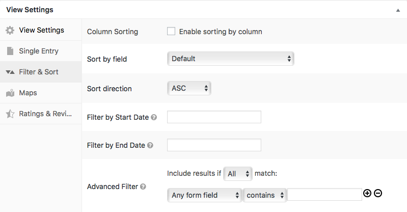

* **Column Sorting**
  * If this enabled, users will be able to sort columns on their own by clicking a small arrow.
* **Sort by field**
  * This lets you choose which Field is used to display the Entries.
* **Sort direction**
  * _ASC_ stands for _Ascending_ and will display your Entries from A to Z.
  * _DESC_ stands for _Descending_ and will display your Entries from Z to A.
  * _Random_ will display your Entries randomly.
* **Filter by Start Date**
  * This option lets you only display Entries submitted _**after**_ a certain date. It supports both specific dates and relative time periods, like "-1 week." This  is useful if you want to display only the most recent submitted Entries.
* **Filter by End Date**
  * This option is the opposite of the above _Filter by Start Date_. It lets you display Entries submitted **before** a certain date. This is useful if you want to limit a View to a specific period of time, like "last month".

Hopefully you now understand how the Multiple Entries Context works. In the next lesson, we'll talk about the second View Context - the _Single Entry Context._

