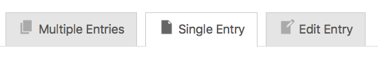
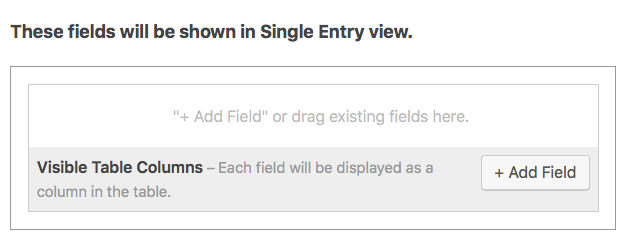
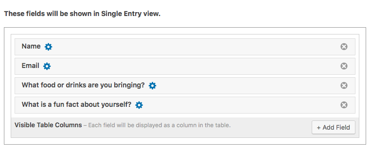
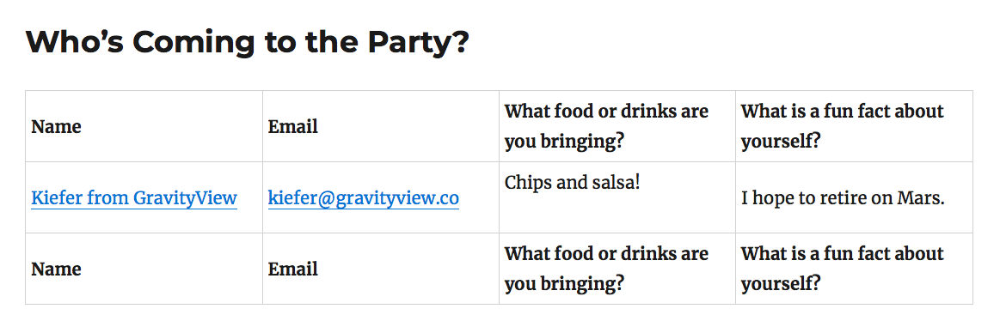
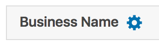

# Lesson 5: The Single Entry Context

You've made it to Lesson 5! Some congratulations is in order.🍾 At this point, you should be becoming a GravityView expert!

As we talked about the _Multiple Entries Context_ in the last lesson. This lesson, we'll talk about the _Single Entry Context_.

Let's go!

## What is the Single Entry Context?

Put simply, the _Single Entry Context_ is where you can put more details for each Entry.

While the _Multiple Entries Context_ is for displaying _a few details about many Entries_ on an overview page, the _Single Entry Context_ is for displaying _many details about a single Entry_ on an individualized page.

**To summarize:**

* **Multiple Entries Context**
  * Many Entries, few Fields
* **Single Entry Context**
  * One Entry, many Fields

## Adding Fields to the Single Entry Page

Now, let's add some Fields. To edit which Fields will display on the Single Entry Context, first go to the _Single Entry_ tab.

Scroll down and you'll see a place for adding your Fields. To add a Field, simply click _Add Field._

Just like the Multiple Entries Context, you can choose from all available Fields. Since we have much more room on this Single Entry page, we can add more Fields.

> **Pro-tip:** if you want to add the _Edit Entry Link_ to your View, it's generally better to do so on the Single Entry Context and not the Multiple Entries Context. Why? More room.

It's really that simple! You can also fine-tune the settings by clicking on the gear icon next to each Field. If we preview our View, you'll see that we have much more room for displaying our Entry's Fields:

## View Settings

Way at the bottom of the _View Configuration_ page, you can customize some settings for the _Single Entry Context_.

**There are two options:**

* **Single Entry Title**
  * This lets you choose a different title for the Single Entry page. By default, the title will be the same as the one for the 
  * For example, you may want the _Multiple Entries Context_ to be titled "List of All Businesses" while the _Single Entry Context_ to be titled "Business Details".
* **Back Link Label**
  * This controls the text of the "return button." By default, it just says "Go back."

## Linking to the Single Entry Context

In the last lesson, we talked about linking to the Single Entry Context from the Multiple Entries Context. If you didn't get a chance to read that section, we'll cover it again here.

If you want to link an Entry on the Multiple Entries page to its Single Entry page. No problem? Simply click the gear icon next to the Field \(make sure you're on the _Multiple Entries Context_ tab first\).

Then, click _Link to single Entry._ Once you enable this option, the Field will link to its Single Entry Context.

When you enable the link option, the Field will have a small link icon displayed:

As an example: if your Field is _Business Name_ and you enable _Link to Single Entry_, clicking on the _Business Name_ Field will take to you that business's Single Entry page.

Although it is typically used on the _Name_ field, you can also activate the _Link to Single Entry_ option on any text Field.

**That about covers the Single Entry Context!** In the next lesson, we'll wrap up talking about View Contexts with the third and final one: the _Edit Entry Context._

