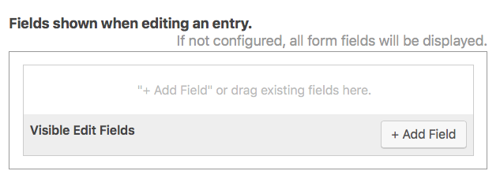
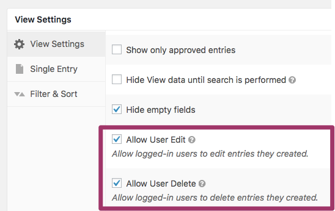
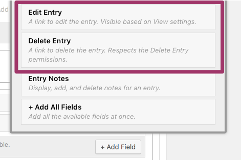
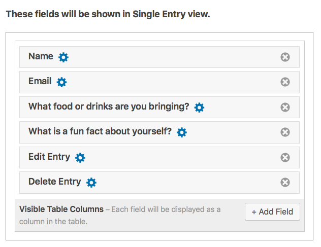
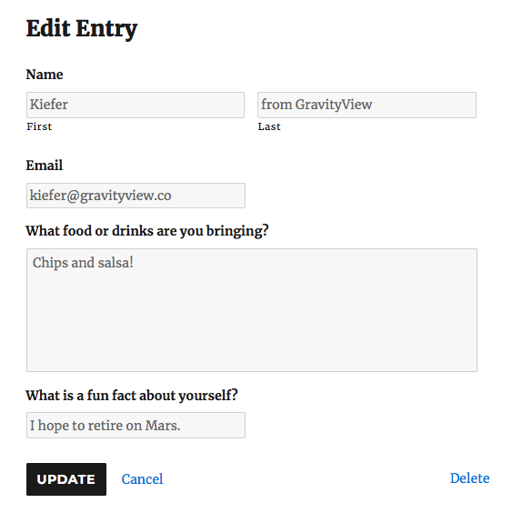

# Lesson 6: The Edit Entry Context

The _Edit Entry Context_ allows users \(or administrators\) to edit their Entries on the front end of the website without having to log in to the back end.

In Gravity Forms, the only way to edit the fields of an entry is on the Back End of the website. However, with GravityView's _Edit Entry_ context, we can create a separate page that allows admins and/or users to edit entries.

## View Configuration

The View Configuration screen for the _Edit Entry_ context is pretty straightforward.

To add a Field, simply click _Add Field._ Any fields that are added will be editable on the Edit Entry page. If for some reason you don't want a particular field to be editable, don't add it to the View.

For example, you may want to let businesses change their Web Address or \(physical\) Address, but not their Business Name. In this instance, you'd simply add the _Web Address_ and _Address_ Fields and **not** add the Name Field.

You can also drag-and-drop the Fields to be in the order you prefer.

**If you don't add** _**any**_ **Fields,** _**all**_ **form fields will be displayed and editable on the Edit Entry page.**

## Allowing Users to Edit Their Own Entries

By default, the Edit Entry page is only visible to administrators and users that have permission to edit entries in the WordPress back end.

But what if we want users to be able to edit and delete the fields in their entry? To do that, we'll need to enable some options in the _View Settings._

> **Tip:** Want to let a particular user edit all entries, even if they didn't create them? [Check out this Knowledge Base article.](https://docs.gravityview.co/article/261-allowing-any-and-all-logged-in-user-to-edit-entries)

### _Allow User Edit_ and _Allow User Delete_

Specifically, we want to enable two options:

* _Allow User Edit_
* _Allow User Delete_

When checked, logged-in users will be allowed to edit and delete Entries that they have created, respectively. They will _not_ be able to edit or delete Entries created by other users.

To enable these options, simply scroll to the bottom of the View Configuration page. Under _View Settings_, check one \(or both\) options.

### Adding the Edit and Delete Fields

Now that we've allowed users to edit and delete their Entries, we need to add these fields to the View. If we don't manually add them to our View, users won't actually be able to access the Edit Entry page.

We can put these Fields on either the _Multiple Entries_ page or the _Single Entry_ page \(or both\). Often, the _Single Entry_ page is a better choice - it has more room for extra fields. But it's up to you!

To add the fields, simply click _Add Field_ and scroll down to the bottom of the modal window. Then, click _Edit Entry_ and/or _Delete Entry._

These Fields will now be displayed on the Single Entry page. You can also customize the Fields by clicking the blue gear icon.

> **Tip:** We suggest changing the _Edit Entry_ link text to something like, "Edit Your Information" or "Edit User Details." It's more user-friendly.

If we preview our View, you'll see that we now have two new links at the bottom:

Click on _Edit Entry_ and to edit your Entries. Our party guests will no doubt find this useful!

Note that a _Delete Entry_ link is also displayed below the Fields themselves, so including it directly on the Edit Entry page itself can be a little redundant:

It's also important to realize that these Fields will only be visible to Administrators _unless_ you enable the _Allow User Edit_ and _Allow User Delete_ options that we mentioned in the last section. **Simply adding the fields is not sufficient; administrators will be able to see them, but logged-in users won't.**

### Some Additional Notes on _User Edit_

* When a user is logged-out, they will not see the Edit Entry links at all.
* When a user is logged-in, they'll only see links to edit the Entries that they have created.
* Administrators can edit all Entries. 
* Any WordPress User that has permission to edit Entries within Gravity Forms can also edit all Entries.
  * If you want to limit this capability, use the [Members plugin](http://wordpress.org/plugins/members/) to limit each user's "gravityforms\_edit\_entries" capability.

## Other Ways to Edit Entries with our _Inline Edit_ Plugin

Our Inline Edit premium plugin allows you to essentially bypass the Edit Entry page entirely. Rather than edit each Entry individually, one at a time, you can edit every Field with a single click. As you can imagine, this can save you a ton of time!

**Normally, there are only two ways to edit Entries within Gravity Forms and GravityView:**

1. On the back end of the website on the _Forms &gt; Entries &gt; \[Your Entry\]_ page for your particular Entry.
2. By adding the _Edit Entry_ page to your View, as we detailed in this guide.

**However, with our** _**Inline Edit**_ **plugin, you can add three more ways:**

1. Directly on the Multiple Entries page.
2. Directly on Single Entry page.
3. Directly on the back end _Forms &gt; Entries_ page. 

[Check out this page to learn more about the _Inline Edit_ Premium plugin.](https://gravityview.co/extensions/gravityview-inline-edit/) We'll also be covering _Inline Edit_ in a later lesson of GravityView Academy.

## Conclusion

That about covers the _Edit Entry Context!_ In the next lesson, we'll talk about Searching for Entries and how to add a search function to your View.

