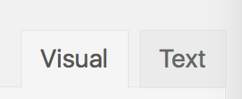

# Lesson 9: Embedding Views and Entries

Want to embed your View on WordPress page or post? What about a specific Entry? Not a problem! In this lesson, we'll learn how to embed Views and specific Entries.

Let's get started!

## Embedding a View

You can embed a View on any WordPress page or post via a shortcode. Here's how:

#### 1. First, go to your View's configuration page.

On the right side, under _Publish_, you'll see an Embed Shortcode. Copy this shortcode.

#### 2. Go to your WordPress page or post page.

Paste the code into your Page or Post editor.

Voilà - that's it! Your View is now embedded. You can also just click _Add View_ directly in the Post/Page editor:

#### Customizing the Embedded View

The \[gravityview\] shortcode can accept a number of parameters. The most commonly-used ones are...

* `id` - The ID of the View you want to display _\(required\)_
* `page_size` - Number of entries to show at a time _\(Defaults to View setting\)_
* `sort_field` - What form field id should be used to sort? _\(See note\)_
* `sort_direction` - ASC / DESC
* `search_field` - Only display entries with this text in the value _\(See note\)_
* `search_value` - Only display entries with this text in the value

[Read the full list of parameters on this page.](https://docs.gravityview.co/article/73-using-the-shortcode)

## Embedding Views in Sidebar or Footer Widgets

Want to embed a View in a sidebar or footer widget? Unfortunately, the \[gravityview\] shortcode won't work in a standard Custom HTML widget by default. Instead, you'll need to install an additional plugin called [Shortcode Widget](https://wordpress.org/plugins/shortcode-widget/).

When you install this plugin, a _Shortcode Widget_ option will be added to your _WordPress &gt; Widgets_ page.

Simply drag this widget to your WordPress sidebar or footer and paste the shortcode:

Your View will now be displayed!

## Embedding a Specific Entry

What if you want to embed a specific Entry, rather than the entire View? Easy-peasy.

* Embedded Entries can be edited like normal
* Embedded Entries will display with the same configuration as on your View's _Single Entry_ tab.
* You can embed multiple Entries on the same post or page.

### 1. First, navigate to your View.

In the View, navigate to the specific Single Entry that you want to embed by clicking on the Single Entry link.

### 2. Then, copy the URL of the Single Entry page.

Notice that this Entry has a specific number \(11\). Each Entry has its own ID number.

### 3. Go to your WordPress Page or Post.

First, make sure you're on the _Visual_ tab:

Then, place your cursor where you want to put the Entry. Paste the URL, wait a moment, and you should see an image automatically appear:

Finally, save \(or update\) your Post or Page. Click _View Post_ and you'll see your Entry! It's that easy.

